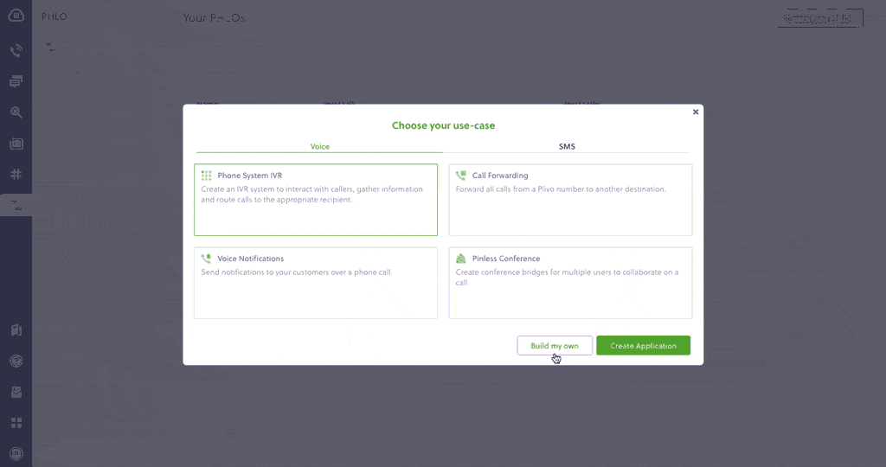

# Technical Guide: Migrating from Twilio to Plivo

## Introduction
Migrating from Twilio to Plivo is a seamless and painless process. The two companies’ API structures, implementation mechanisms, XML structure, SMS message processing, and voice call processing are similar. We wrote this technical comparison between Twilio and Plivo APIs so that you can scope the code changes for a seamless migration. 

## Understanding the differences between Twilio and Plivo development
Most of the APIs and features that are available on Twilio are also available on Plivo and the implementation mechanism is easier as the steps involved are almost identical. This table gives a side-side comparison of the two companies’ features and APIs. An added advantage with Plivo is that not only can you code using the old familiar API/XML method, you can also implement your use cases using PHLO (Plivo High Level Objects), a visual workflow builder that lets you create workflows by dragging and dropping components onto a canvas — no coding required. 

<table class="table table-striped table-markdown">
    <tr>
        <td><strong>Features and APIs</strong></td>
        <td><strong>Twilio</strong></td>
        <td><strong>Plivo</strong></td>
        <td><strong>Similarities</strong></td>
        <td><strong>Implementation Interface</strong></td>
    </tr>
    <tr>
        <td><a href="https://plivo.com/docs/messaging/">SMS API</a>: Send SMS/MMS messages</td>
        <td>✅</td>
        <td>✅</td>
        <td>Request and response variables’ structure</td>
        <td>
            API<br />
            PHLO<br />
        </td>
    </tr>
    <tr>
        <td><a href="https://www.plivo.com/docs/messaging/powerpack/">Managed number pool</a> for US/CA Messaging</td>
        <td>Copilot</td>
        <td>Powerpack</td>
        <td>Feature parity</td>
        <td>
            API<br />
            Console<br />
        </td>
    </tr>
    <tr>
        <td><a href="https://www.plivo.com/docs/messaging/concepts/geo-permissions/">Geo Permissions</a></td>
        <td>✅</td>
        <td>✅</td>
        <td>Feature parity</td>
        <td>Console</td>
    </tr>
    <tr>
        <td><a href="https://www.plivo.com/docs/messaging/concepts/sender-id-usage/">SMS Sender ID registration</a></td>
        <td>✅</td>
        <td>✅</td>
        <td>Feature parity</td>
        <td>Console</td>
    </tr>
    <tr>
        <td><a href="https://www.plivo.com/docs/lookup/">Number Lookup API</a></td>
        <td>✅</td>
        <td>✅</td>
        <td>API Parity</td>
        <td>API</td>
    </tr>
    <tr>
        <td><a href="https://www.plivo.com/docs/numbers/">Phone number management</a></td>
        <td>✅</td>
        <td>✅</td>
        <td>Feature parity</td>
        <td>
            API<br />
            Console<br />
        </td>
    </tr>
    <tr>
        <td><a href="https://www.plivo.com/docs/messaging/concepts/signature-validation/">Validating Requests</a></td>
        <td>✅</td>
        <td>✅</td>
        <td>Feature parity</td>
        <td>
            API<br />
            XML<br />
        </td>
    </tr>
    <tr>
        <td>Subaccounts</td>
        <td>✅</td>
        <td>✅</td>
        <td>Feature parity</td>
        <td>API</td>
    </tr>
    <tr>
        <td><a href="https://www.plivo.com/docs/messaging/concepts/callbacks/">HTTP callbacks</a></td>
        <td>✅</td>
        <td>✅</td>
        <td>Feature parity</td>
        <td>
            API<br />
            XML<br />
            PHLO<br />
        </td>
    </tr>
</table>

## Plivo account creation

Start by [signing up for a free trial account](https://console.plivo.com/accounts/register/) that you can use to experiment with and learn about our services. The free trial account comes with free credits, and you can [add more](https://console.plivo.com/payments/) as you go along. You can also [add a phone number](https://console.plivo.com/phone-numbers/search/) to your account to start testing the full range of our voice and SMS features. A page in our support portal [walks you through the signup process](https://support.plivo.com/hc/en-us/articles/360041203772).

You can also port your numbers from Twilio to Plivo, as we explain in [this guide](#porting-your-existing-numbers-from-twilio-to-plivo). 

## Migrating your SMS application

You can migrate your existing application from Twilio to Plivo by refactoring the code, or you can try our intuitive visual workflow builder [PHLO](https://console.plivo.com/phlo/list/). To continue working with the APIs, use one of the quickstart guides to set up a development environment for your preferred language. Plivo offers server SDKs in seven languages: [PHP](/docs/messaging/quickstart/php-laravel/), [Node.js](/docs/messaging/quickstart/node-expressjs/), [.NET](/docs/messaging/quickstart/dotnet-framework/), [Java](/docs/messaging/quickstart/java-spring/), [Python](/docs/messaging/quickstart/python-flask/), [Ruby](/docs/messaging/quickstart/ruby-rails/), and [Go](/docs/messaging/quickstart/go-gin/). For another alternative that lets you evaluate Plivo’s SMS APIs and their request and response structure, use our [Postman collections](/docs/messaging/quickstart/postman/).


### How to send an SMS message

Let’s take a look at the process of refactoring the code to migrate your app from Twilio to Plivo to set up a simple Python application to send an SMS message by changing just a few lines of code.

<table class="table table-striped table-markdown comparison-table">
<tr>
<td><strong>Twilio</strong></td>
<td><strong>Plivo</strong></td>
</tr>
<tr>
<td>
  <div>
    ```python
    import os
    from twilio.rest import Client
    account_sid = os.environ["<twilio_account_sid>"]
    auth_token = os.environ["<twilio_auth_token>"]
    client = Client(account_sid, auth_token)

    message = client.messages.create(
        from_="+12125551234",
        to="+13125552345",
        body="Hi there"
    )

    print(message)
    ```
  </div>
</td>

<td>

<div>
    ```python
import os, plivo

auth_id = os.environ["<plivo_auth_id>"]
auth_token = os.environ["<plivo_auth_token>"]
client = plivo.RestClient(auth_id, auth_token)

message = client.messages.create(
    src="+12125551234",
    dst="+13125552345",
    text="Hi there"
)
print(message)
```
</div>
</td>
</tr>
</table>

Alternatively, you can implement the same functionality using one of our [PHLO templates](https://console.plivo.com/phlo/list/). For example, if you want to send an SMS message, your PHLO would be this:



### How to receive and reply to SMS
You can migrate an application for receiving and replying to an incoming SMS from Twilio to Plivo just as seamlessly, as in this example:

<table class="table table-striped table-markdown comparison-table">
<tr>
<td><strong>Twilio</strong></td>
<td><strong>Plivo</strong></td>
</tr>
<tr>
<td>
<div>
    ```pyhton
from flask import Flask, request, redirect
from twilio.twiml.messaging_response import MessagingResponse

app = Flask(__name__)


@app.route("/reply_sms", methods=["GET", "POST"])
def sms_reply():
    """Respond to incoming calls with a simple text message."""
    # Start our TwiML response
    resp = MessagingResponse()

    # Add a message
    resp.message("Thank you, we have received your request.")
    
    return str(resp)


if __name__ == "__main__":
    app.run(debug=True)
   ```
    </div>
</td>
<td>
    <div>
    ```python
from flask import Flask, request, make_response, Response
from plivo import plivoxml

app = Flask(__name__)


@app.route("/reply_sms", methods=["GET", "POST"])
def sms_reply():

    from_number = request.values.get("From")
    to_number = request.values.get("To")
    text = request.values.get("Text")
    
    # Plivo Message XML to handle Reply
    response = plivoxml.ResponseElement()
    response.add(
        plivoxml.MessageElement(
            "Thank you, we have received your request.", src=to_number, dst=from_number
        )
    )
    
    return Response(response.to_string(), mimetype="application/xml")


if __name__ == "__main__":
    app.run(debug=True)
```
    </div>
</td>
</tr>
</table>

Here again, you can implement the same functionality using one of our [PHLO templates](https://console.plivo.com/phlo/list/). Your PHLO would look like:


For more information about migrating your SMS applications to Plivo, check out our [detailed use case guides](/docs/messaging/use-cases/send-an-sms/node/), available for all seven programming languages and PHLO. 

### How to send an MMS message
Let’s take a look at the process of refactoring the code to migrate your app from Twilio to Plivo to set up a simple Python application to send an MMS message by changing just a few lines of code.

<table class="table table-striped table-markdown comparison-table">
<tr>
<td><strong>Twilio</strong></td>
<td><strong>Plivo</strong></td>
</tr>
<tr>
<td>
<div>
    ```python
import os
from twilio.rest import Client

account_sid = os.environ['<twilio_account_sid>']
auth_token = os.environ['<twilio_auth_token>']
client = Client(account_sid, auth_token)

message = client.messages.create(
        from_='+12125551234',
        to='+13125552345',
        body='Use this GIF',
        media_url=['https://media.giphy.com/media/26gscSULUcfKU7dHq/source.gif']
     )

print(message)
   ```
    </div>
</td>
<td>
    <div>
        ```python
        import os, plivo

        auth_id = os.environ["<plivo_auth_id>"]
        auth_token = os.environ["<plivo_auth_token>"]
        client = plivo.RestClient(auth_id, auth_token)

        message = client.messages.create(
            src='+12125551234',
            dst='+13125552345',
            text='Use this GIF',
            media_urls=['https://media.giphy.com/media/26gscSULUcfKU7dHq/source.gif'],
            type_='mms'
        )
        print(message)
        ```
    </div>
</td>

</tr>
</table>

Alternatively, you can implement the same functionality using one of our [PHLO templates](https://console.plivo.com/phlo/list/). For example, if you want to send an MMS message, your PHLO would be this:


### More use cases
You can migrate your applications serving various other use-cases like the following ones too:

* [Two-factor authentication](/docs/messaging/use-cases/2-factor-authentication/node/)
* [Forward Incoming SMS](/docs/messaging/use-cases/forward-incoming-sms/node/)
* [Delivery reports](/docs/messaging/use-cases/delivery-reports/node/)
* [SMS alerts](/docs/messaging/use-cases/sms-alert/node/)
* [SMS marketing](/docs/messaging/use-cases/sms-marketing/node/)
* [SMS notifications](/docs/messaging/use-cases/sms-notification/node/)
* [SMS survey](/docs/messaging/use-cases/sms-survey/node/)
* [SMS autoresponder](/docs/messaging/use-cases/sms-autoresponder/node/)
* [Forward SMS to email](/docs/messaging/use-cases/forward-sms-to-email/node/)
* [Receive MMS](/docs/messaging/use-cases/receive-mms/python/)

## Porting your existing numbers from Twilio to Plivo
If you wish to continue using your phone numbers from Twilio, you can port the numbers to Plivo painlessly without having any downtime on your services for your customers. Phone number porting must be requested by a phone number’s owner. Here’s an overview of the process for porting a phone number to Plivo:

1. Submission of a porting request with documentation
2. Verification of the porting request
3. Porting request submission to the gaining carrier
4. Porting request submission to the losing carrier
5. Response from the losing carrier
6. Firm Order Commitment or porting date set

You can check our [number porting guide](/docs/numbers/number-porting/) to initiate the process. 

## Buy new phone numbers for your migrated app
You can buy new phone numbers on the Plivo platform for your migrated applications as well. Plivo provides a self-serve [console](https://console.plivo.com/active-phone-numbers/) to buy new numbers and to manage them. You can also use the [Phone Numbers API](/docs/numbers/api/overview/) for number management. You can check this [guide](/docs/numbers/guides/buy-a-number/) to learn more. 
