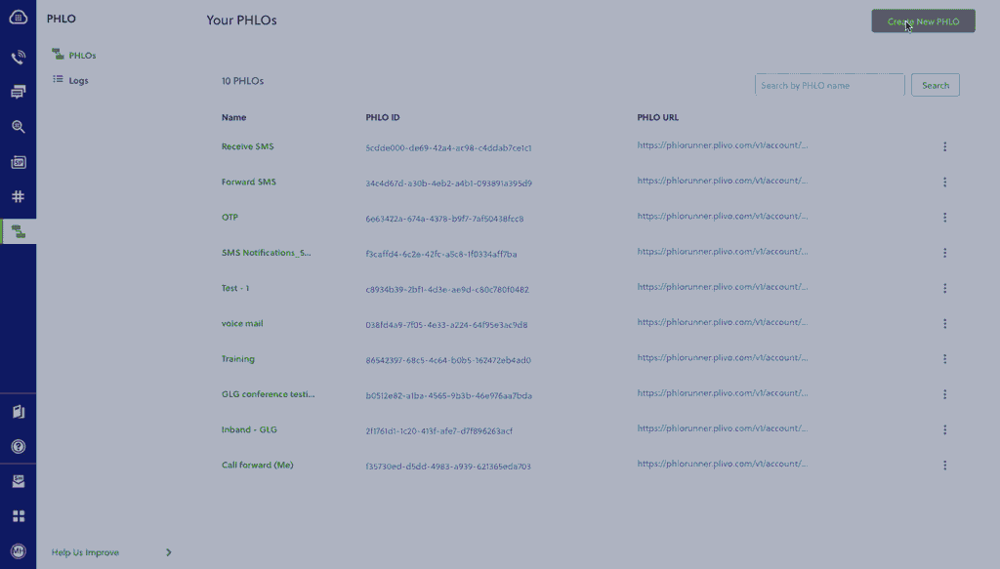

# Technical Guide: Migrating from Zipwhip to Plivo

Migrating from Zipwhip to Plivo is a seamless and painless process. The two companies’ API structures, implementation mechanisms, SMS message processing, and MMS message processing are similar. We wrote this technical comparison between Zipwhip and Plivo APIs so that you can scope the changes for a seamless migration.

### Understanding the differences between Zipwhip and Plivo development

Most of the APIs and features that are available on Zipwhip are also available on Plivo, and the steps involved are almost identical. This table gives a side-by-side comparison of the two companies’ features and APIs. An added advantage with Plivo is that not only can you code using the old familiar API method, you can also implement your use cases using PHLO (Plivo High Level Objects), a visual workflow builder that lets you create workflows by dragging and dropping components onto a canvas — no coding required.

<table class="table table-striped table-markdown">
    <tr>
        <td><strong>Features and APIs</strong></td>
        <td><strong>Zipwhip</strong></td>
        <td><strong>Plivo</strong></td>
        <td><strong>Similarities</strong></td>
        <td><strong>Implementation Interface</strong></td>
    </tr>
    <tr>
        <td><a href="https://plivo.com/docs/messaging/">SMS API</a>: Send SMS messages</td>
        <td>✅</td>
        <td>✅</td>
        <td>Request and response variables’ structure</td>
        <td>
        	API<br />
            PHLO<br />
	    </td>
    </tr>
    <tr>
        <td><a href="https://plivo.com/docs/messaging/">MMS API</a>: Send MMS messages</td>
        <td>✅</td>
        <td>✅</td>
        <td>Request and response variables’ structure</td>
        <td>
        	API<br />
            PHLO<br />
	    </td>
    </tr>
    <tr>
        <td><a href="https://console.plivo.com/sms/10dlc/brand/">10DLC</a>: 10-digit long code (10DLC) phone numbers</td>
        <td>✅</td>
        <td>✅</td>
        <td>Registration process and usage</td>
        <td><a href="https://console.plivo.com/sms/10dlc/brand/">Console</a></td>
    </tr>
    <tr>
        <td><a href="/docs/messaging/powerpack/">Managed number pool</a> for US/CA Messaging</td>
        <td>NA</td>
        <td>Powerpack</td>
        <td>Feature parity</td>
        <td>
        	API<br />
            Console<br />
    	</td>
    </tr>
    <tr>
        <td><a href="/docs/numbers/">Phone number management</a></td>
        <td>✅</td>
        <td>✅</td>
        <td>Feature parity</td>
        <td>
        	API<br />
            Console<br />
    	</td>
    </tr>
    <tr>
        <td><a href="/docs/messaging/concepts/callbacks/">HTTP callbacks</a></td>
        <td>✅</td>
        <td>✅</td>
        <td>Feature parity</td>
        <td>
            API<br />
            XML<br />
            PHLO<br />
        </td>
    </tr>
</table>

### Plivo account creation
Start by [signing up for a free trial account](https://console.plivo.com/accounts/register/) that you can use to experiment with and learn about our services. The free trial account comes with free credits, and you can [add more](https://console.plivo.com/payments/) as you go along. You can also [add a phone number](https://console.plivo.com/phone-numbers/search/) to your account to start testing the full range of our voice and SMS features. A page in our support portal [walks you through the signup process](https://support.plivo.com/hc/en-us/articles/360041203772).

You can also port your numbers from Zipwhip to Plivo, as we explain in [this guide](/docs/messaging/migrate/twilio/#porting-your-existing-numbers-from-twilio-to-plivo).

### Migrating your SMS application
You can migrate your existing application from Zipwhip to Plivo by refactoring the code, or you can try our intuitive visual workflow builder [PHLO](https://console.plivo.com/phlo/list/). To continue working with the APIs, use one of the quickstart guides to set up a development environment for your preferred language. Plivo offers server SDKs in seven languages: [PHP](/docs/messaging/quickstart/php-laravel/), [Node.js](/docs/messaging/quickstart/node-expressjs/), [.NET](/docs/messaging/quickstart/dotnet-framework/), [Java](/docs/messaging/quickstart/java-spring/), [Python](/docs/messaging/quickstart/python-flask/), [Ruby](/docs/messaging/quickstart/ruby-rails/), and [Go](/docs/messaging/quickstart/go-gin/). For another alternative that lets you evaluate Plivo’s SMS APIs and their request and response structure, use our [Postman collections](/docs/messaging/quickstart/postman/).

#### How to send an SMS message

Let’s take a look at the process of refactoring the code to migrate your app from Zipwhip to Plivo to set up a simple cURL application to send an SMS message by changing just a few lines of code.

<table class="table table-striped table-markdown comparison-table">
<tr>
<td><strong>Zipwhip</strong></td>
<td><strong>Plivo</strong></td>
</tr>
<tr>
<td>
<div>
    ```curl
curl -X POST \
"https://api.zipwhip.com/message/send" \
-d "session=$ZIPWHIP_SESSION_KEY" \
-d "contacts=$MOBILE_PHONE_NUMBER" \
-d "body=Hello from Zipwhip API"
   ```
    </div>
</td>
<td>
    <div>
    ```curl
curl -i --user auth_id:auth_token \
    -H "Content-Type: application/json" \
    -d '{"src": "<sender_id>","dst": "<destination_number>", "text": "Hello from Plivo API"}' \
https://api.plivo.com/v1/Account/{auth_id}/Message/
```
    </div>
</td>
</tr>
</table>

Alternatively, you can implement the same functionality using one of our [PHLO templates](https://console.plivo.com/phlo/list/). For example, if you want to send an SMS message, your PHLO would look like this.


### Migrating your MMS application
#### How to send an MMS message
Let’s take a look at the process of refactoring the code to migrate another application from Zipwhip to Plivo — a simple cURL application to send an MMS message — by changing just a few lines of code.

<table class="table table-striped table-markdown comparison-table">
<tr>
<td><strong>Zipwhip</strong></td>
<td><strong>Plivo</strong></td>
</tr>
<tr>
<td>
<div>
    ```curl
curl -X POST \
"https://api.zipwhip.com/messaging/send" \
-H "Content-Type: multipart/form-data" \
-F "session=$ZIPWHIP_SESSION_KEY" \
-F "to=$MOBILE_PHONE_NUMBER" \
-F "file=@owl.png;type=image/png"
   ```
    </div>
</td>
<td>
    <div>
    ```curl
curl -i --user auth_id:auth_token \
    -H "Content-Type: application/json" \
    -d '{"src": "<sender_id>","dst": "<destination_number>", "text": "Hello from Plivo", "type": "mms","media_urls": ["https://media.giphy.com/media/26gscSULUcfKU7dHq/source.gif"],"url":"https://<yourdomain></yourdomain>.com/sms_status/"}' \
    https://api.plivo.com/v1/Account/{auth_id}/Message/
```
    </div>
</td>
</tr>
</table>

Alternatively, you can implement the same functionality using one of our [PHLO templates](https://console.plivo.com/phlo/list/). For example, if you want to send an MMS message, your PHLO would look like this.



#### More use cases
You can migrate applications for other use cases too:

* [Reply to incoming SMS messages](/docs/messaging/use-cases/reply-to-incoming-sms/node/)
* [Two-factor authentication](/docs/messaging/use-cases/2-factor-authentication/node/)
* [Forward incoming SMS messages](/docs/messaging/use-cases/forward-incoming-sms/node/)
* [Delivery reports](/docs/messaging/use-cases/delivery-reports/node/)
* [SMS alerts](/docs/messaging/use-cases/sms-alert/node/)
* [SMS marketing](/docs/messaging/use-cases/sms-marketing/node/)
* [SMS notifications](/docs/messaging/use-cases/sms-notification/node/)
* [SMS survey](/docs/messaging/use-cases/sms-survey/node/)
* [SMS autoresponder](/docs/messaging/use-cases/sms-autoresponder/node/)
* [Forward SMS to email](/docs/messaging/use-cases/forward-sms-to-email/node/)
* [Receive MMS](/docs/messaging/use-cases/receive-mms/python/)

### Porting your existing numbers from Zipwhip to Plivo
If you want to continue using your phone numbers from Zipwhip, you can port the numbers to Plivo painlessly without having any downtime on your services for your customers. Our [number porting guide](/docs/numbers/number-porting/) shows you how to initiate the process.

### Buy new phone numbers for your migrated app
You can buy new phone numbers on the Plivo platform for your migrated applications as well. Plivo provides a self-serve [console](https://console.plivo.com/active-phone-numbers/) to buy new numbers and to manage them. You can also use the [Phone Numbers API](/docs/numbers/api/overview/) for number management. You can check this [guide](/docs/numbers/guides/buy-a-number/) to learn more.