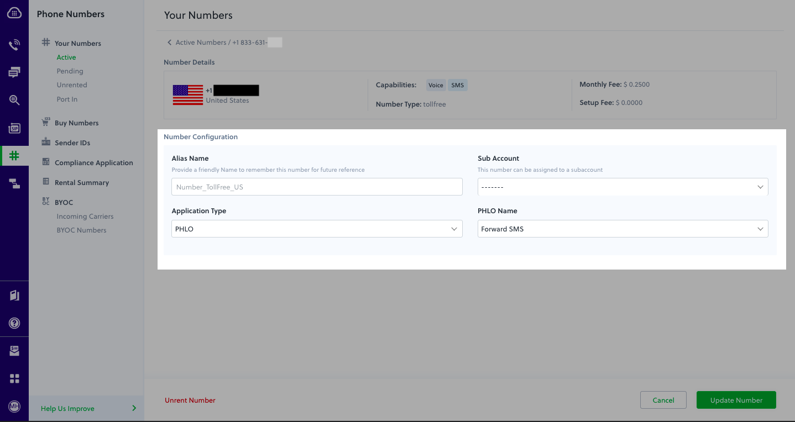

import Tabs from '@theme/Tabs';
import TabItem from '@theme/TabItem';

<Tabs className="custom-tabs-container">
      <TabItem value="PHP Server" label="PHP Server" default>
        # PHP Quickstart


## Sign up for a Plivo account

When you [Sign up with your work email address](https://console.plivo.com/accounts/register/), we give you a free trial account and free credits to experiment with and learn about our services. You can [add a number](https://console.plivo.com/phone-numbers/search/) to your account to start testing the full range of our voice and SMS service features.

Follow these steps to get a free trial account:

  **1.** [Sign up](https://console.plivo.com/accounts/register/) with your work email address.
  
  **2.** Check your inbox for an activation email message from Plivo. Click on the link in the message to activate your account.
  
  **3.** Enter your mobile number to complete the phone verification step.


## Sign up with your work email address


If you have any issues creating a Plivo account, please contact our [support team](https://support.plivo.com/hc/en-us/) for assistance.

To get started, try sending an SMS message either by using our API and XML documents, or via PHLO, our visual design tool, which allows you to create message flows using an intuitive canvas and deploy them with few clicks.

<Tabs>
  <TabItem value="Using PHLO" label="Using PHLO" default>
    #### Set up your Node.js and Express dev environment

You must set up and install Node.js, Express, and Plivo’s Node.js SDK before you send your first message.

You can check whether you have Node.js installed under macOS or Linux by running the command ```node --version``` in a terminal window. Under Windows, open a Windows command prompt or PowerShell and type ```node -v```. If you don’t have Node.js installed or want a more current version, download and install it.

```bash
$ mkdir mynodeapp
$ cd mynodeapp
```
Install the Plivo Node.js SDK using [npm](https://www.npmjs.com/package/plivo).
```bash
$ npm install plivo
```
Once you’ve set up your development environment, you can start sending and receiving messages using [PHLO](https://www.plivo.com/docs/phlo/), our visual workflow design studio, or using our APIs and XML documents. Here are three common use cases to get you started.

#### Send your first outbound SMS/MMS message

You can create and deploy a PHLO to send your first outbound SMS message with a few clicks on the PHLO canvas, and trigger it with some simple code.

### Create the PHLO

<Tabs>
<TabItem value="SMS" label="SMS" default>

</TabItem>
<TabItem value="MMS" label="MMS" default>

</TabItem>
</Tabs>

##### Install the Plivo Node.js package

To create a PHLO, visit the [PHLO](https://console.plivo.com/phlo/list/) page of the Plivo console. If this is your first PHLO, the PHLO page will be empty.

- Click **Create New PHLO**.
- In the **Choose your use case** pop-up, click **Build my own**.The PHLO canvas will appear with the **Start** node.

>**Note:** The Start node is the starting point of any PHLO. It lets you trigger a PHLO to start upon one of three actions: incoming SMS message, incoming, or API request.

- From the list of components on the left-hand side, drag and drop the **Send Message** component onto the canvas. When a component is placed on the canvas, it becomes a node.
- Draw a line to connect the **Start** node’s API Request trigger state to the **Send Message** node.
- In the Configuration pane at the right of the canvas, configure the **Send Message** node with a sender ID in the **From** field. Enter the destination number you wish to send a message to in the **To** field. Put your message in the **Text** field.

>**Note**: You can define a static payload by specifying values when you create the PHLO, or define a dynamic payload by passing values through Liquid templating parameters when you trigger the PHLO from your application.

- If you’d like to send an MMS message, configure the **Media URLs** field with the media files you’d like to send.

- Once you’ve configured the node, click **Validate** to save the configuration.

- After you complete the configuration, give the PHLO a name by clicking in the upper left, then click **Save**.

Your PHLO is now ready to test.

#### Trigger the PHLO

You integrate a PHLO into your application workflow by making an API request to trigger the PHLO with the required payload — the set of parameters you pass to the PHLO. You can define a static payload by specifying values when you create the PHLO, or define a dynamic payload by passing values through parameters when you trigger the PHLO from your application.

In either case, you need your Auth ID and Auth Token, which you can get from the overview page of the Plivo [console](https://console.plivo.com/dashboard/).


You also need the PHLO ID, which you can copy from the [PHLO list](https://console.plivo.com/phlo/list/) page.


##### With a static payload

When you configure values when creating the PHLO, they act as a static payload.


#### Code

Create a file called **TriggerPhlo.js** and paste into it this code.

```bash
var express = require('express')
var app = express()

app.post('/trigger_phlo/', function(req, res) {
    var plivo = require('plivo');
    var PhloClient = plivo.PhloClient;
    var authId = '<auth_id>';
    var authToken = '<auth_token>';
    var phloId = '<phlo_id>';
    var phloClient = phlo = null;

    phloClient = new PhloClient(authId, authToken);
    phloClient.phlo(phloId).run().then(function(result) {
        console.log('Phlo run result', result);
    }).catch(function(err) {
        console.error('Phlo run failed', err);
    })
})

app.set('port', (process.env.PORT || 5000));
app.listen(app.get('port'), function() {
    console.log('Node app is running on port', app.get('port'));
});
```
Replace the auth placeholders with your authentication credentials from the [Plivo console](https://console.plivo.com/dashboard/). Replace the phlo_id placeholder with your PHLO ID from the [Plivo console](https://console.plivo.com/dashboard/). Replace the phone number placeholders with actual phone numbers in [E.164](https://en.wikipedia.org/wiki/E.164) format (for example, +12025551234).

#### Test

Save the file and run it.

```bash
$ node TriggerPhlo.js
```

> **Note:** If you’re using a Plivo Trial account, you can send messages only to phone numbers that have been verified with Plivo. You can verify (sandbox) a number by going to the console’s Phone Numbers > [Sandbox Numbers](https://console.plivo.com/phone-numbers/sandbox-numbers/) page.

#### Receive your first inbound SMS/MMS message
You can create and deploy a PHLO to receive an inbound text message with a few clicks on the PHLO canvas, without writing a single line of code.

##### Prerequisite
To receive incoming text messages, you must have an SMS-enabled Plivo phone number. You can rent numbers from the [Numbers](https://console.plivo.com/active-phone-numbers/) page of the Plivo console, or by using the [Numbers API](https://www.plivo.com/docs/numbers/).

### Create the PHLO
Create a projects directory and change into it.

<Tabs>
<TabItem value="SMS" label="SMS" default>

</TabItem>
<TabItem value="MMS" label="MMS" default>

</TabItem>
</Tabs>

To create a PHLO, visit the [PHLO](https://console.plivo.com/phlo/list/) page of the Plivo console. If this is your first PHLO, the PHLO page will be empty.

- Click **Create New PHLO**.

- In the **Choose your use case** pop-up, click **Build my own**. The PHLO canvas will appear with the **Start** node.

> **Note:** The Start node is the starting point of any PHLO. It lets you trigger a PHLO to start upon one of three actions: incoming SMS message, incoming call, or API request.

- From the list of components on the left-hand side, drag and drop the **HTTP Request** component onto the canvas. When a component is placed on the canvas it becomes a node.

- Draw a line to connect the **Start** node’s **Incoming Message** trigger state to the **HTTP Request** node.

- In the Configuration pane at the right of the canvas, configure the **HTTP Request** node. Specify the address of your web server and specify that from, to, and text fields should be passed along with the request.

- Once you’ve configured the node, click **Validate** to save the configuration.

- After you complete the configuration, give the PHLO a name by clicking in the upper left, then click **Save**.

#### Assign the PHLO to a Plivo number

Once you’ve created and configured your PHLO, assign it to a Plivo number.

- On the Numbers page of the console, under **Your Numbers**, click the phone number you want to use for the PHLO.

- In the **Number Configuration** box, select **PHLO** from the **Application Type** drop-down.

- From the **PHLO Name** drop-down, select the PHLO you want to use with the number, then click **Update Number**.


##### Test
You can now send a text message to your Plivo phone number and see how the inbound text is handled.

For more information about creating a PHLO application, see the [PHLO Getting Started guide](https://www.plivo.com/docs/phlo/). For information on components and their variables, see the PHLO Components Library.

##### Forward an incoming SMS/MMS message
You can create and deploy a workflow to implement text message forwarding with a few clicks on the PHLO canvas.

##### Prerequisite
To receive incoming text messages, you must have an SMS-enabled Plivo phone number. You can rent numbers from the [Numbers](https://console.plivo.com/active-phone-numbers/) page of the Plivo console, or by using the [Numbers API](https://www.plivo.com/docs/numbers/).

<Tabs>
<TabItem value="SMS" label="SMS" default>

</TabItem>
<TabItem value="MMS" label="MMS" default>

</TabItem>
</Tabs>

To create a [PHLO](https://console.plivo.com/phlo/list/), visit the PHLO page of the Plivo console. If this is your first PHLO, the PHLO page will be empty.

- Click **Create New PHLO.**

- In the **Choose your use case** pop-up, click **Build my own**. The PHLO canvas will appear with the **Start** node.

>**Note:** The Start node is the starting point of any PHLO. It lets you trigger a PHLO to start upon one of three actions: incoming SMS message, incoming call, or API request.

- From the list of components on the left-hand side, drag and drop the **Send Message** component onto the canvas. When a component is placed on the canvas it becomes a node.

- Draw a line to connect the Start node’s Incoming Message trigger state to the **Send Message** node.

- In the Configuration pane at the right of the canvas, configure the **Send Message** node with the phone number to which you want to forward the message.

Once you’ve configured the node, click **Validate** to save the configuration.

After you complete the configuration, give the PHLO a name by clicking in the upper left, then click **Save**.

#### Assign the PHLO to a Plivo number
Once you’ve created and configured your PHLO, assign it to a Plivo number.

- On the [Numbers](https://console.plivo.com/active-phone-numbers/) page of the console, under **Your Numbers**, click the phone number you want to use for the PHLO.

In the **Number Configuration** box, select **PHLO** from the **Application Type** drop-down.

From the **PHLO Name** drop-down, select the PHLO you want to use with the phone number, then click **Update Number**.



#### Test
You can now send a text message to your Plivo phone number and see how the inbound text is forwarded.

For more information about creating a PHLO application, see the [PHLO Getting Started guide](https://www.plivo.com/docs/phlo/). For information on components and their variables, see the [PHLO Components Library](https://www.plivo.com/docs/phlo/components/).

#### More use cases
We illustrate [more than a dozen use cases](https://www.plivo.com/docs/messaging/use-cases/send-an-sms/node/) with code for both PHLO and API/XML on our documentation pages.

</TabItem>

  <TabItem value="Using API" label="Using API">
    #### Install Node.js, Express, and the Plivo Node.js SDK

You must set up and install Node.js, Express, and Plivo’s Node.js SDK before you send your first message.

#### Install Node.js

You can check whether you have Node.js installed under macOS or Linux by running the command ```node --version``` in a terminal window. Under Windows, open a Windows command prompt or PowerShell and type ```node -v```. If you don’t have Node.js installed or want a more current version, [download and install it](https://nodejs.org/en/download/).

#### Install Express and the Plivo Node.js SDK

Create a projects directory and change into it.
```bash
$ mkdir mynodeapp
$ cd mynodeapp
```
Install Express and the Plivo Node.js SDK using npm.
```bash
$ npm install express plivo
```
Once you’ve set up your development environment, you can start sending and receiving messages using our APIs and XML documents. Here are three common use cases to get you started.

#### Send your first outbound SMS/MMS message

You must have a Plivo phone number to send messages to the US or Canada; you can rent a Plivo number from Phone Numbers > [Buy Numbers](https://console.plivo.com/phone-numbers/search/) on the Plivo console or via the [Numbers API](https://www.plivo.com/docs/numbers/api/phone-number/#buy-a-phone-number).

#### Create an Express server
Create a file called **SendSMS.js** and paste into it this code.
<Tabs>
<TabItem value="SMS" label="SMS" default>

</TabItem>
<TabItem value="MMS" label="MMS" default>

</TabItem>
</Tabs>

To create a API, visit the [API](https://console.plivo.com/phlo/list/) page of the Plivo console. If this is your first API, the API page will be empty.

- Click **Create New API**.

- In the **Choose your use case** pop-up, click **Build my own**. The API canvas will appear with the **Start** node.

> **Note:** The Start node is the starting point of any API. It lets you trigger a API to start upon one of three actions: incoming SMS message, incoming call, or API request.

- From the list of components on the left-hand side, drag and drop the **HTTP Request** component onto the canvas. When a component is placed on the canvas it becomes a node.

- Draw a line to connect the **Start** node’s **Incoming Message** trigger state to the **HTTP Request** node.

- In the Configuration pane at the right of the canvas, configure the **HTTP Request** node. Specify the address of your web server and specify that from, to, and text fields should be passed along with the request.

- Once you’ve configured the node, click **Validate** to save the configuration.

- After you complete the configuration, give the API a name by clicking in the upper left, then click **Save**.

#### Assign the API to a Plivo number

Once you’ve created and configured your API, assign it to a Plivo number.

- On the Numbers page of the console, under **Your Numbers**, click the phone number you want to use for the API.

- In the **Number Configuration** box, select **API** from the **Application Type** drop-down.

- From the **API Name** drop-down, select the API you want to use with the number, then click **Update Number**.


##### Test
You can now send a text message to your Plivo phone number and see how the inbound text is handled.

For more information about creating a API application, see the [API Getting Started guide](https://www.plivo.com/docs/phlo/). For information on components and their variables, see the API Components Library.

##### Forward an incoming SMS/MMS message
You can create and deploy a workflow to implement text message forwarding with a few clicks on the API canvas.

##### Prerequisite
To receive incoming text messages, you must have an SMS-enabled Plivo phone number. You can rent numbers from the [Numbers](https://console.plivo.com/active-phone-numbers/) page of the Plivo console, or by using the [Numbers API](https://www.plivo.com/docs/numbers/).

<Tabs>
<TabItem value="SMS" label="SMS" default>

</TabItem>
<TabItem value="MMS" label="MMS" default>

</TabItem>
</Tabs>

To create a [API](https://console.plivo.com/phlo/list/), visit the API page of the Plivo console. If this is your first API, the API page will be empty.

- Click **Create New API.**

- In the **Choose your use case** pop-up, click **Build my own**. The API canvas will appear with the **Start** node.

>**Note:** The Start node is the starting point of any API. It lets you trigger a API to start upon one of three actions: incoming SMS message, incoming call, or API request.

- From the list of components on the left-hand side, drag and drop the **Send Message** component onto the canvas. When a component is placed on the canvas it becomes a node.

- Draw a line to connect the Start node’s Incoming Message trigger state to the **Send Message** node.

- In the Configuration pane at the right of the canvas, configure the **Send Message** node with the phone number to which you want to forward the message.

Once you’ve configured the node, click **Validate** to save the configuration.

After you complete the configuration, give the API a name by clicking in the upper left, then click **Save**.

#### Assign the API to a Plivo number
Once you’ve created and configured your API, assign it to a Plivo number.

- On the [Numbers](https://console.plivo.com/active-phone-numbers/) page of the console, under **Your Numbers**, click the phone number you want to use for the API.

In the **Number Configuration** box, select **API** from the **Application Type** drop-down.

From the **API Name** drop-down, select the API you want to use with the phone number, then click **Update Number**.


#### Test
You can now send a text message to your Plivo phone number and see how the inbound text is forwarded.

For more information about creating a API application, see the [API Getting Started guide](https://www.plivo.com/docs/phlo/). For information on components and their variables, see the [API Components Library](https://www.plivo.com/docs/phlo/components/).

#### More use cases
We illustrate [more than a dozen use cases](https://www.plivo.com/docs/messaging/use-cases/send-an-sms/node/) with code for both API and API/XML on our documentation pages.

  </TabItem>
</Tabs>
</TabItem>
      <TabItem value="PHP Laravel" label="PHP Laravel">
        # PHP Larval Quickstrart
        ## Sign up for a Plivo account

When you [Sign up with your work email address](https://console.plivo.com/accounts/register/), we give you a free trial account and free credits to experiment with and learn about our services. You can [add a number](https://console.plivo.com/phone-numbers/search/) to your account to start testing the full range of our voice and SMS service features.

Follow these steps to get a free trial account:

  **1.** [Sign up](https://console.plivo.com/accounts/register/) with your work email address.
  
  **2.** Check your inbox for an activation email message from Plivo. Click on the link in the message to activate your account.
  
  **3.** Enter your mobile number to complete the phone verification step.

#### Send your first outbound SMS/MMS message

You can create and deploy a PHLO to send your first outbound SMS message with a few clicks on the PHLO canvas, and trigger it with some simple code.

### Create the PHLO

<Tabs>
<TabItem value="SMS" label="SMS" default>

</TabItem>
<TabItem value="MMS" label="MMS" default>

</TabItem>
</Tabs>

      </TabItem>
    </Tabs>